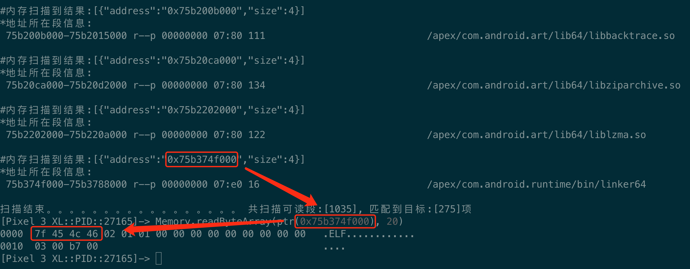

# FridaAndroidMemoryScan
使用frida在Android内存中扫描目标内容

Usage:
    1.Modify the value of the pattern variable as the search target, the current default value is "7f 45 4c 46"
    2.frida -U -p [pid] -l frida_android_memory_scan.js
      or 
      frida -U -f [packageName] -l frida_android_memory_scan.js --no-pause

    notes: If there is an error, please try to enter %reload

